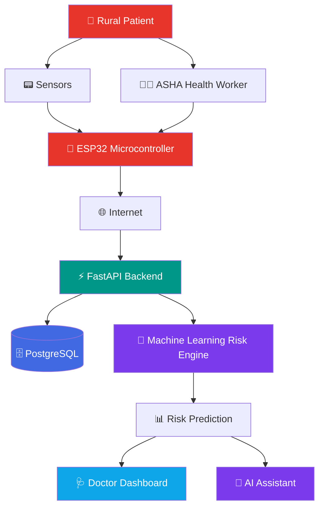

<div align="center">


<br/><br/>


# SMART-RHMS
### Smart Rural Health Monitoring & Management System

**IoT vitals monitoring · AI-driven risk prediction · Telemedicine — engineered for rural, low-connectivity healthcare.**

<p>


</p>

<p>


</p>

**[Live Demo](#) · [Documentation](#-api-reference) · [Report Bug](../../issues) · [Request Feature](../../issues)**

<br/>

<!-- Animated typing banner — same service used on GitHub profile READMEs -->
<a href="#">
  
</a>

<br/><br/>

<!-- Live/dynamic badges -->


</div>

<br/>

## 📌 Why SMART-RHMS?

Over **65% of India's population lives in rural areas**, yet the doctor-to-patient ratio there is a
fraction of urban centers, and hospitals can be hours away. Chronic conditions — hypertension,
diabetes, COPD — go unmonitored between visits, and by the time a patient reaches a clinic, a
preventable complication has often already become an emergency.

**SMART-RHMS closes that gap.** A low-cost ESP32 + sensor kit continuously streams vitals from
the patient's home to the cloud, where a risk engine flags anything abnormal *before* it becomes
critical — routing the alert to the nearest ASHA worker and doctor, with a teleconsultation only a
tap away.

<br/>

## 🏗 System Architecture



> GitHub renders this diagram automatically — no image needed.

| Layer | Responsibility | Status |
|:--|:--|:--:|
| 📟 ESP32 Firmware | Reads HR / SpO₂ / temperature / BP, pushes to the API | 🔜 Planned |
| ⚡ **FastAPI Backend** | Auth, patient registry, ingestion, alerting | ✅ **Live** |
| 🗄️ **PostgreSQL** | Patients, vitals, risk scores, alert history | ✅ **Live** |
| 🤖 ML Risk Engine | Flags abnormal vitals; upgradeable to a trained model | ✅ **v0 Live** |
| 🩺 Doctor Dashboard | Prioritized triage view, patient trends | ✅ Prototype |
| 💬 AI Assistant | Natural-language querying over patients & alerts | 🔜 Planned |

<br/>

## ✨ Key Features

<table>
<tr>
<td width="50%" valign="top">

**🔴 Real-Time Monitoring**
Live heart rate, SpO₂, temperature, and blood pressure streamed from wearable sensors, visualized with rolling trend charts.

**🧠 AI Risk Scoring**
Every reading is scored instantly. Rule-based today, structured to drop in a trained classifier with zero API changes.

**🚨 Smart Alerting**
Threshold breaches auto-generate alerts routed to the right ASHA worker and doctor, with a full acknowledgment audit trail.

</td>
<td width="50%" valign="top">

**🏘️ Built for the Field**
Village-based patient registry designed around how ASHA workers actually operate — offline-tolerant by design.

**🔐 Role-Based Security**
JWT auth for humans (ASHA / doctor / admin), separate device-key auth for hardware — no shared human credentials on IoT devices.

**📹 Integrated Telemedicine**
One tap from a flagged patient to a teleconsultation request — no app-switching required.

</td>
</tr>
</table>

<br/>

## 🎬 Demo

<div align="center">
<i>Add a screen recording or GIF of the dashboard here — repos with a visual demo get significantly more engagement.</i><br/>
<code>docs/demo.gif</code>
</div>

<br/>

## 🚀 Quick Start

```bash
git clone https://github.com/YOUR-USERNAME/smart-rhms.git
cd smart-rhms
cp .env.example .env
docker compose up --build
```

Backend live at `http://localhost:8000` · Interactive API docs at `http://localhost:8000/docs`

No hardware yet? Simulate an ESP32:

```bash
python scripts/simulate_device.py --device-id ESP32-001 --api-key <your-device-key>
```

<br/>

## 📡 API Reference

| Method | Endpoint | Description |
|:--|:--|:--|
| `POST` | `/auth/register` | Register an ASHA worker, doctor, or admin |
| `POST` | `/auth/login` | Get a JWT access token |
| `POST` | `/patients` | Register a patient and link a device ID |
| `GET` | `/patients` | List patients, optionally filtered by village |
| `GET` | `/patients/{id}/vitals` | Full vitals history for a patient |
| `GET` | `/patients/{id}/risk` | Latest AI risk score for a patient |
| `POST` | `/devices/vitals` | ESP32 posts a new sensor reading here |
| `GET` | `/alerts` | List alerts, filterable by acknowledgment status |
| `POST` | `/alerts/{id}/acknowledge` | Mark an alert as handled |

Full interactive Swagger docs auto-generate at `/docs`.

<br/>

## 🛠 Tech Stack

<p>

</p>

**Backend** FastAPI · SQLAlchemy · Pydantic · JWT (python-jose) · bcrypt
**ML** Rule-based risk engine (scikit-learn-ready)
**Frontend** React · Recharts · Tailwind CSS
**Hardware** ESP32 · pulse-oximeter, HR, and temperature sensors
**Infra** Docker · Docker Compose · PostgreSQL

<br/>

## 📂 Project Structure

```
smart-rhms-backend/
├── app/
│   ├── main.py              FastAPI app & router registration
│   ├── models.py            SQLAlchemy models
│   ├── schemas.py           Pydantic request/response schemas
│   ├── auth.py              JWT + device-key auth
│   ├── ml/risk_model.py     Risk prediction (rule-based → ML-ready)
│   └── routers/             auth · patients · vitals · alerts
├── scripts/simulate_device.py   ESP32 stand-in for local development
├── docker-compose.yml
└── README.md
```

<br/>

## 🗺 Roadmap

- [x] Core backend — FastAPI + PostgreSQL
- [x] Rule-based risk scoring engine
- [x] Doctor dashboard prototype
- [ ] ESP32 firmware for live sensor ingestion
- [ ] Trained ML model replacing rule-based v0
- [ ] AI assistant for natural-language triage queries
- [ ] SMS fallback alerts for zero-connectivity villages
- [ ] Village-scoped data access for ASHA workers

<br/>

## 🤝 Contributing

Contributions are welcome. Fork the repo, create a feature branch, and open a PR — for larger
changes, please open an issue first to discuss the approach.

```bash
git checkout -b feature/your-feature
git commit -m "Add: your feature"
git push origin feature/your-feature
```

<br/>

## 📄 License

Distributed under the MIT License. See [`LICENSE`](LICENSE) for details.

<br/>

<div align="center">

**If this project is useful to you, consider giving it a ⭐ — it helps others discover it.**

<sub>Built as a demonstration of an IoT + AI-assisted rural health monitoring pipeline. Not a certified medical device.</sub>

</div>